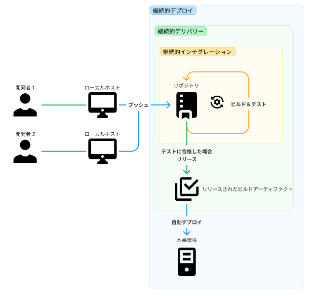

問題:
現在の状況では、継続的インテグレーション (CI) は導入されていますが、顧客分析を含む新機能やアップデートを効率的にデプロイすることに課題があります。これにより、顧客分析と新機能のデプロイの間に遅延が生じ、競争力を維持するための迅速な展開が妨げられています。

解決策の提案:

1. 自動化されたデプロイメントパイプラインの構築:
新機能やアップデートを含むコードがリポジトリにプッシュされると、自動的にテスト、ビルド、デプロイがトリガーされるデプロイメントパイプラインを構築します。
このパイプラインは、継続的デリバリー (CD) の原則に基づいて、自動化されたテストスイートを実行し、デプロイ可能な状態を確認します。
また、本番環境だけでなく、ステージング環境やテスト環境などの環境にも自動的にデプロイできるようにします。
ステージング環境でのデプロイメントを用いて、新機能やアップデートのテストと承認を行い、本番環境へのデプロイ前に問題を特定します。
2. 静的コード解析とセキュリティスキャン:
デプロイメントパイプラインに静的コード解析ツールやセキュリティスキャンツールを統合し、コードの品質とセキュリティを自動的にチェックします。

